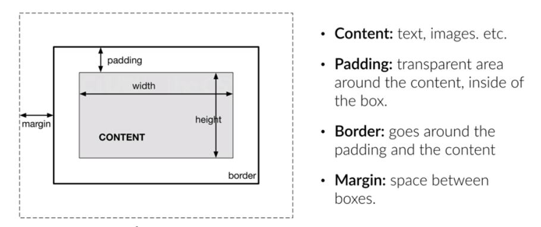
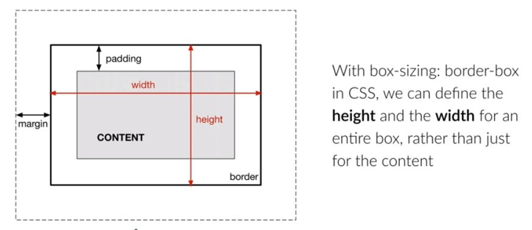

# CSS Box Model

[Reference Code](https://github.com/koushik-ai-distsys/web-dev-toolbox/blob/master/html_css/projects/blog_post/style.css)



Padding, margin and border are properties in CSS. They can be specified for the entire box or for individual sides.
- Top
- Bottom
- Left 
- Right

The box model also allows us to set the height and width of an element.

The annoying thing about the standard box model is that you set the *height and width of just the content* and **not the entire box**. (i.e. Padding, margin and border will be added on top of the height and width we specify, which is not what we want.)

## Solution
Set the following CSS property:
```css
box-sizing:border-box
```



## **Points to note:**
- In HTML, there are **block elements** and **inline** elements.
- Block elements 
    - use the entire width of the browser
    - force line breaks
    - e.g. headings, paragraphs
- Inline elements don't do the above
    - e.g. images, links, strong, em
    - height and width can be set for these elements    

## Reference
- https://www.udemy.com/course/design-and-develop-a-killer-website-with-html5-and-css3/